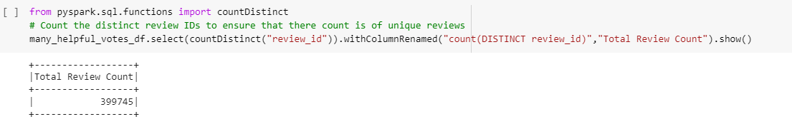

# Analysis of Amazon Book Reviews

## Overview

For this analysis, the Amazone reviews for books were imported and analyzed to determine how much paid reviews affected the useful reviews.  To do this, the data was imported into a dataframe on Google Colab using PySpark to manage the large amount of records. The dataset was whittled down to only reviews that had 20 or more votes that it was a useful review.  From there, we looked at how many of those were from paid/vine reviewers.

## Results

Below are observations we made from our querying:

* The original dataset contained over 3 million reviews.  Only 2 of these reviews were vine reviews:

* 
*     The breakdown of 

After filtering the list down to only reviews that had 20 or more votes, we were working with about 400,000 records as you can see here:  From this 400k recordset, the following was determined:

*  Within this subset, there were no vine reviews.  There were only 2 total vine reviews in the 3 million records so this was not a surprise:

How many Vine reviews were 5 stars? How many non-Vine reviews were 5 stars?
What percentage of Vine reviews were 5 stars? What percentage of non-Vine reviews were 5 stars?

