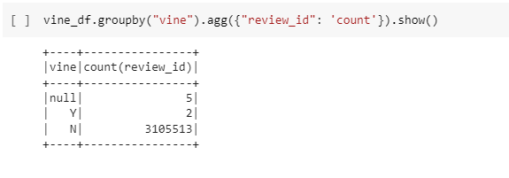
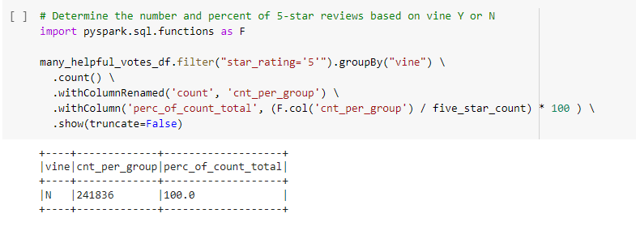

# Analysis of Amazon Book Reviews

## Overview

For this analysis, the Amazon reviews for books were imported and analyzed to determine if paid/vine reviews were affecting the overall rating.To do this, the data was imported into a dataframe on Google Colab using PySpark to manage the large amount of records. The dataset was first whittled down to only reviews that had 20 or more votes that it was a useful review.  From there, we looked at how many of the 5-star reviews were from paid/vine reviewers.  

## Results

Below are observations we made:

* The original dataset contained over 3 million reviews.  Only 2 of these reviews were vine reviews and 5 were unclassified:

*  We wanted to look at only useful reviews so we whittled the list down to only those that had 20-or-more votes that it was useful:

*  From there, we looked at how many of the helpful reviews were 5-stars.  From the ~400k helpful results, there were about ~242k that were 5-stars:

* Of the 5-star reviews, 100% of them were unpaid reviews.  This was not surprising due to the low number of vine/paid reviews in the overall dataset:

## Summary

In summary, we built a framework to analyze how much paid reviews affect the number of 5-star reviews for a product.  If there were a lot of paid reviews that were 5-stars, we could hypothesis that there was bias in the overall rating of the product.  This dataset wasn't particularly interesting with the low number of paid reviews but for someone looking to buy a good book, it was great to see that the helpful 5-star reviews were not paid/vine reviews.  

